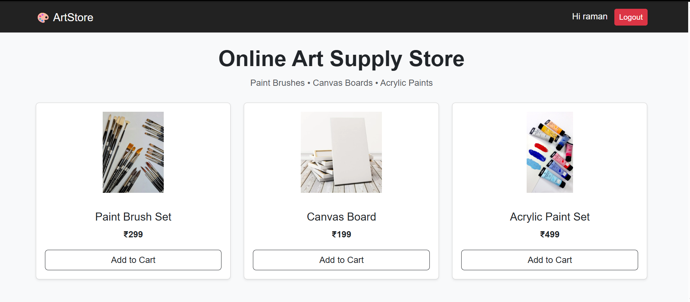

# 🎨 ArtStore

A modern, full-stack Online Art Supply Store built with Django, designed to deliver a smooth and secure e-commerce experience for art materials.


---


## 🚀 Overview

ArtStore is a full-stack web application that allows users to browse, add, and purchase art supplies such as paint brushes, canvas boards, and acrylic paints.
It features secure authentication, cart management, and a QR-based checkout flow, demonstrating real-world Django development.

📌 This project is built as a case study to showcase full-stack development using Python Django with a responsive frontend.


---


## ✨ Key Features

- 🔐 User Registration & Login (Django Authentication)

- 🛍️ Browse Art Products

- ➕ Add / ❌ Remove items from Shopping Cart

- 🧾 Session-based Cart Management

- 💳 Buy Now with QR Code Payment

- 🎨 Clean & Responsive UI

- 🛠️ Admin Panel for Product Management


---


## 🧰 Tech Stack
### Backend : 

- Python

- Django

- SQLite (easily upgradeable to MySQL)

### Frontend : 

- HTML

- CSS

### Other Tools : 

- QR Code Generation (qrcode, Pillow)

- Git & GitHub


---


## 🖼️ Preview




---


## 📁 Project Structure

```text
artstore/
├── manage.py
├── artstore/              # Project settings
│   ├── settings.py
│   ├── urls.py
│
├── store/                 # Main application
│   ├── models.py
│   ├── views.py
│   ├── urls.py
│
├── templates/             # HTML templates
│   ├── base.html
│   ├── index.html
│   ├── login.html
│   ├── register.html
│   ├── buy.html
│
├── static/
│   └── images/            # Product images
│
├── requirements.txt
├── README.md
└── .gitignore
